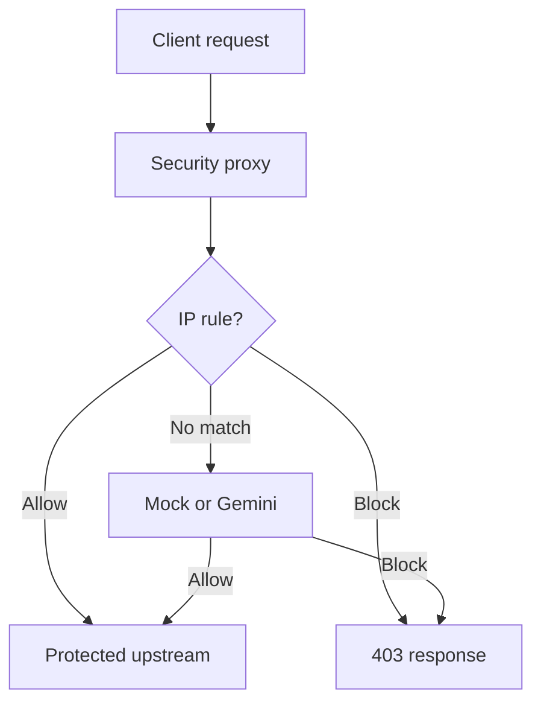

# RevAI

RevAI is a small application-security gateway built for the Axiler assessment. It sits in front of a sample application, applies IP rules, asks a mock or Gemini classifier about requests with no matching rule, records the decision, and gives an administrator a way to inspect traffic and manage blocks. It is a local assessment project, not a production firewall.

## Quick start

1. Install Docker with Compose, clone this repository, and open the repository root.
2. Copy `.env.example` to `.env`. Set a nonempty `ADMIN_TOKEN` and leave `AI_PROVIDER=mock`. No AI API key is needed.
3. Run `docker compose up --build` from the repository root.
4. Open `http://127.0.0.1:5173` and log in with `ADMIN_TOKEN`. Send application requests to `http://127.0.0.1:8080`.
5. Optionally, from PowerShell in the repository root, run `.\scripts\traffic.ps1` and watch the decisions appear in the dashboard.

Compose also starts PostgreSQL, the admin API, and the sample upstream. The upstream's port 3000 is available inside Compose but is not published to the host. The admin API is available at `http://127.0.0.1:9090`.

## Architecture overview

RevAI has two paths: the **traffic path**, which decides whether a request reaches the protected application, and the **admin path**, which lets an operator inspect and manage those decisions.

| Component                | Role                                                                                                                                                                                           |
| ------------------------ | ---------------------------------------------------------------------------------------------------------------------------------------------------------------------------------------------- |
| **Security proxy**       | The public entry point for application traffic on port 8080. It checks IP rules, asks the selected AI provider when no rule matches, blocks or forwards the request, and records the decision. |
| **Rules and PostgreSQL** | PostgreSQL stores manual allow rules, manual and temporary automatic blocks, request logs, and administrator corrections. The proxy reads rules before calling AI.                             |
| **AI provider**          | Mock mode makes deterministic classifications without an API key; Gemini mode calls a real model. AI assists decisions but cannot override a matching manual rule.                             |
| **Sample upstream**      | The protected application used to demonstrate forwarding. Allowed requests reach it through the proxy; blocked requests do not.                                                                |
| **Admin API**            | A separate, token-protected service on port 9090. It reads logs and statistics, manages blocks and corrections, and requests AI recommendations for active blocks.                             |
| **Dashboard**            | The React interface on port 5173. It calls the admin API so an administrator can inspect traffic and take action. It is separate from the client traffic path. (P6)                            |

A client sends an HTTP request to the proxy. The proxy checks stored rules, consults AI only if no rule matches, and either returns a block response or forwards the full request to the upstream. It records the decision in PostgreSQL. The administrator sees those records in the dashboard and can manage blocks through the admin API. The upstream's port 3000 is internal to Docker Compose; clients use the proxy's port 8080.

## Decision pipeline

The proxy handles each request in this order:

1. **Identify the request (P3).** A UUID is generated for each request and used as its `X-Request-ID` in the request log. The same ID is sent to the upstream and returned to the client. For the client IP, I use the network socket address and replace any client-supplied `X-Forwarded-For`, since a client can set that header to any value.

During manual testing, I found that the response could contain a different request ID. This happened because `http-proxy` copies the upstream response headers after the proxy initially sets its response header. If the upstream sends its own `X-Request-ID`, it can replace the proxy-generated ID. I fixed this in the `proxyRes` handler so the client receives the same ID that appears in the proxy’s request log.

2. **Check IP rules (R1, R2).** The manual allowlist is checked first. If the client IP is there, the request is allowed without calling AI. Otherwise, the manual blocklist is checking including the active automatic blocks. A blocked IP receives a `403` response containing `blocked`, `requestId`, and `reason` (P4). Expired automatic blocks no longer match.

3. **Build the AI summary (A1).** If no IP rule matches, A compact summary is built instead of sending the entire request to AI. It contains the method, path, query, client IP, User-Agent, selected headers, the first 2 KB of the body, and that IP's request count in the last minute. This gives AI context for its decision while limiting the amount of request data sent to it. The full body is still available if the request is forwarded upstream.

4. **Get and validate an AI decision (A2, A3).** If neither the allowlist nor the blocklist matches, the request summary is sent to the selected AI provider. The selected provider returns a proposed decision, confidence, category, and reason. These fields are validating before using the result. If the provider times out, errors, or returns invalid data, `FAIL_MODE` decides what happens: `open` allows the request and `closed` blocks it. The default is `open`. These cases are recorded with `source=fallback` so the admin can see when AI was unavailable or its output could not be used.

5. **Apply the confidence threshold (A4).**

A request is not blocked just because AI recommends it. A block recommendation must meet `BLOCK_CONFIDENCE`, which defaults to `0.7`. If it falls below the threshold, the request is allowed but marked as suspicious. This reduces the chance of disrupting a legitimate user because of an uncertain AI result. I manually checked this with a `0.6` confidence block recommendation: the request was allowed, and the dashboard showed a Suspicious badge.

6. **Record decisions and create temporary blocks (R3, A5).** Each decision is recorded with source `rule`, `ai`, or `fallback`, its reason, and any available AI details. This helps the admin understand why a request was allowed or blocked, including when AI failed. Repeated AI blocks from the same IP trigger a temporary block, so the proxy does not have to ask AI about every later request from that IP. By default, five AI blocks within ten minutes create a block lasting 30 minutes.

7. **Return or forward the request (P1, P2, P4, P5).** A blocked request receives a JSON `403` response and never reaches the upstream. An allowed request is forwarded with its method, path, query, headers, and full body. Only the AI summary is limited to the first 2 KB of the body; the upstream receives the complete body. The proxy returns the upstream status and body to the client. Connection-specific headers such as `Connection` and `Keep-Alive` may differ because client→proxy and proxy→upstream are separate connections. If the upstream is unreachable, the proxy returns a JSON `502`; if it times out, the proxy returns a `504`. The proxy uses a 5-second upstream timeout because the assessment does not specify one

8. **AI block review (A6).** An administrator can ask AI to review an active block using up to 50 of that IP's requests from the last ten minutes. The history includes each request's method, path, decision, and reason. In mock mode, the rule is simple: recommend `keep` if any recent request was blocked; otherwise, recommend `lift`. In Gemini mode, the model reviews that history and gives a `keep` or `lift` recommendation with a reason. The review does not treat a manual block as evidence that recent requests were malicious, so a manual block with no recent blocked requests may receive a `lift` recommendation. The administrator decides whether to act; the review itself never removes the block.
